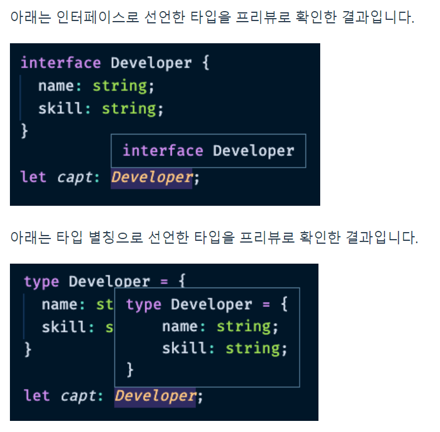

# 타입 별칭 (Type Aliases)


### 0. 기본 예시
```
type MyName = string;
const name: MyName = 'capt';
```

<br />

### 1. 타입 별칭 코드 예제
- object
```
interface IPerson {
    name: string;
    age: number;
}

type TPerson = {
    name: string;
    age: number;
}

const seho: TPerson = {
    name: '세호',
    age: 30
}
```

- string
```
type MyString = string;
const str: MyString = 'hello';
```

- object (함수 파라미터)
```
type Todo = {
    id: string;
    title: string;
    done: boolean;
}
function getTodo(todo: Todo) {
    // 생략
}
```

- 타입을 정의할 수 있는 모든 곳에 적용 가능함

<br />

### 2. 타입과 인터페이스의 차이점
- 프리뷰
    

- 확장성
    - 타입 : 확장 불가능
    - 인터페이스 : 확장 가능(extends) -> 권장
