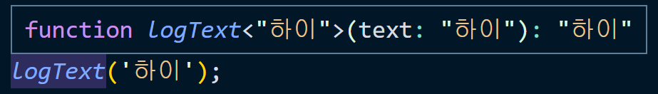
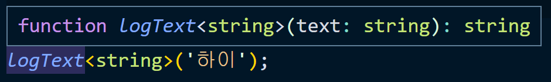
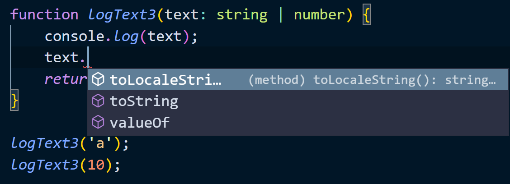
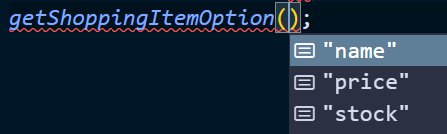

# 제네릭 (Generics)

## 1. 제네릭 소개
- 제네릭이란 타입을 마치 함수의 파라미터처럼 사용하는 것을 의미
- 제네릭 기본 문법 : `<T>` 로 표현
```
function getText<T>(text: T): T {
    return text;
}
```

<br />

## 2. 제네릭의 기본 문법
```
function logText<T>(text: T): T {
    console.log(text);
    return text
}

// 호출하는 시점에 타입을 넘겨줌
logText('하이');

// 넘길 인자의 타입을 string 으로 제네릭으로 정의함
logText<string>('하이');
```



<br />

## 3. 기존 타입 정의 방식과 제네릭의 차이점 - 함수 중복 선언의 단점

- 기존 타입 방식
```
function logText(text) {
    console.log(text);
    return text;
}
// text는 어떤 타입이든 받는 any 가 됨
logText2('a');
logText2(10);
logText2(true);
```

- 어떤 타입인지 지정하지 않으면 각 타입에 맞는 프로퍼티와 메서드를 사용할 수 없음
- 그렇다고 각각 다른 타입으로 지정하면 비효율적인 코드가 됨
    ```
    function logText(text: string) {
        console.log(text);
        return text;
    }
    function logNum(num: number) {
        console.log(num);
        return num;
    }
    ```
<br />

## 4. 기존 문법과 제네릭의 차이점 - 유니온 타입을 이용한 선언 방식의 문제점
- 유니온 타입 이용 시, 문제점
```
function logText(text: string | number) {
    console.log(text);
    return text;
}
logText('a');
logText(10);
```
- 1. 함수 호출 시에는 문제 없지만, 함수 내부에서 각 타입의 프로퍼티와 메서드가 호출되지 않음 (string과 number 공통속성만 나옴)


- 2. 반환값의 타입이 지정되지 않고, string | number 가 됨.
    ```
    const a = logText('a');
    // a의 타입은 string | number 가 되어 String 에서 제공되는 메서드 사용 불가함.
    ```
<br />

## 5. 제네릭의 장점과 타입 추론에서의 이점
```
function logText<T>(text: T): T {
    console.log(text);
    return text
}

logText<string>('하이');
logText<boolean>(true);
```
- 함수 호출 시 타입 정의함
- 타입 추론도 해줌


<br />

## 6. 제네릭 실전 예제 살펴보기 - 예제 설명
- dropdown
```
const emails = [
    {value: 'naver.com', selected: true},
    {value: 'gmail.com', selected: false},
    {value: 'hanmail.net', selected: false},
];

const numberOfProducts = [
    {value: 1, selected: true},
    {value: 2, selected: false},
    {value: 3, selected: false},
];

function createDropdownItem(item) {
    const option = document.createElement('option');
    option.value = item.value.toString();
    option.innerText = item.value.toString();
    option.selected = item.selected;
    return option;
}

// 이메일 드롭다운 아이템 추가
emails.forEach(function (email) {
    const item = createDropdownItem(email);
    const selectTag = document.querySelector('#email-dropdown');
    selectTag.appendChild(item);
})
```

<br />

## 7. 제네릭 실전 예제 살펴보기 - 코드에 타입 정의하기
```
interface Email {
    value: string;
    selected: boolean;
}

interface ProductNumber {
    value: number;
    selected: boolean;
}

const emails: Email[] = [
    {value: 'naver.com', selected: true},
    {value: 'gmail.com', selected: false},
    {value: 'hanmail.net', selected: false},
];

const numberOfProducts: ProductNumber[] = [
    {value: 1, selected: true},
    {value: 2, selected: false},
    {value: 3, selected: false},
];

function createDropdownItem(item: Email | ProductNumber) {
    const option = document.createElement('option');
    option.value = item.value.toString();
    option.innerText = item.value.toString();
    option.selected = item.selected;
    return option;
}

emails.forEach(function (email) {
    const item = createDropdownItem(email);
    const selectTag = document.querySelector('#email-dropdown');
    selectTag.appendChild(item);
})

numberOfProducts.forEach(function(product) {
    const item = createDropdownItem(product);
})
```
- 위 코드처럼 타입을 정의하면 에러발생은 안하지만 코드가 반복되는 문제가 있음

<br />

## 8. 인터페이스에 제네릭을 선언하는 방법
```
interface Dropdown<T> {
    value: T;
    selected: boolean;
}

// 특정 타입을 입력해야 함
const dd1: Dropdown = {value:10, selected:false};  // 에러 발생
const dd2: Dropdown<number> = {value:10, selected:false};
```

<br />

## 9. 제네릭 실전 예제 살펴보기 -  제네릭을 이용한 타입 정의
```
interface Email {
    value: string;
    selected: boolean;
}

interface ProductNumber {
    value: number;
    selected: boolean;
}

interface TrueFalse {
    value: boolean;
    selected: boolean;
}

// 위 코드들이 필요없어짐!
interface DropdownItem<T> {
    value: T;
    selected: boolean;
}

const emails: DropdownItem<string>[] = [
    {value: 'naver.com', selected: true},
    {value: 'gmail.com', selected: false},
    {value: 'hanmail.net', selected: false},
];

const numberOfProducts: DropdownItem<number>[] = [
    {value: 1, selected: true},
    {value: 2, selected: false},
    {value: 3, selected: false},
];
```
- 하나의 인터페이스로 여러가지 타입을 커버할 수 있음 : 제네릭의 장점!
```
function createDropdownItem<T>(item: DropdownItem<T>) {
// function createDropdownItem(item: DropdownItem<string> | DropdownItem<number>) {
    const option = document.createElement('option');
    option.value = item.value.toString();
    option.innerText = item.value.toString();
    option.selected = item.selected;
    return option;
}

emails.forEach(function (email) {
    const item = createDropdownItem<string>(email);
    const selectTag = document.querySelector('#email-dropdown');
    selectTag.appendChild(item);
})

numberOfProducts.forEach(function(product) {
    const item = createDropdownItem<number>(product);
})

```

<br />

## 10. 제네릭의 타입 제한
```
function logTextLength<T>(text: T): T {
    console.log(text.length); // 에러 발생: Property 'length' does not exist on type 'T'.
    return text;
}
// logTextLength에 어떤 타입이 들어올지 알 수 없음

logTextLength('hi')
```

- 타입을 배열로 지정해주면 배열 메서드를 사용할 수 있음
```
function logTextLength2<T>(text: T[]): T[] {
    console.log(text.length);  // ok
    text.forEach(function (text) {
        console.log(text);
    })
    return text;
}
logTextLength2<string>(['hi', 'abc']);
```

<br />

## 11. 정의된 타입으로 타입을 제한하기
```
interface LengthType {
    length: number;
}
// length 속성이 있을 것이라는 것을 extends를 활용해 나타낼 수 있음
function logTextLength3<T extends LengthType>(text: T): T {
    console.log(text.length);
    return text;
}

logTextLength3('a');  // 문자열 length 속성이 제공되어서 ok
logTextLength3(10);  // 숫자는 length 속성이 없어 에러 발생
```

<br />

## 12. keyof로 제네릭의 타입 제한하기
```
interface ShoppingItem {
    name: string;
    price: number;
    stock: number;
}

// ShoppingItem 속성 중 하나만 받는걸로 제약할 수 있음 : keyof 이용
function getShoppingItemOption<T extends keyof ShoppingItem>(itemOption: T): T {
    return itemOption;
}

getShoppingItemOption(10);  // 에러 발생;
getShoppingItemOption('name');
// 키값만 들어갈 수 있음
```



